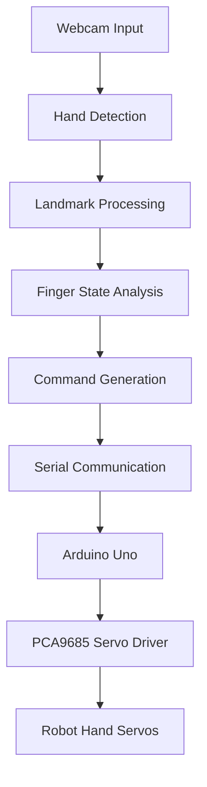
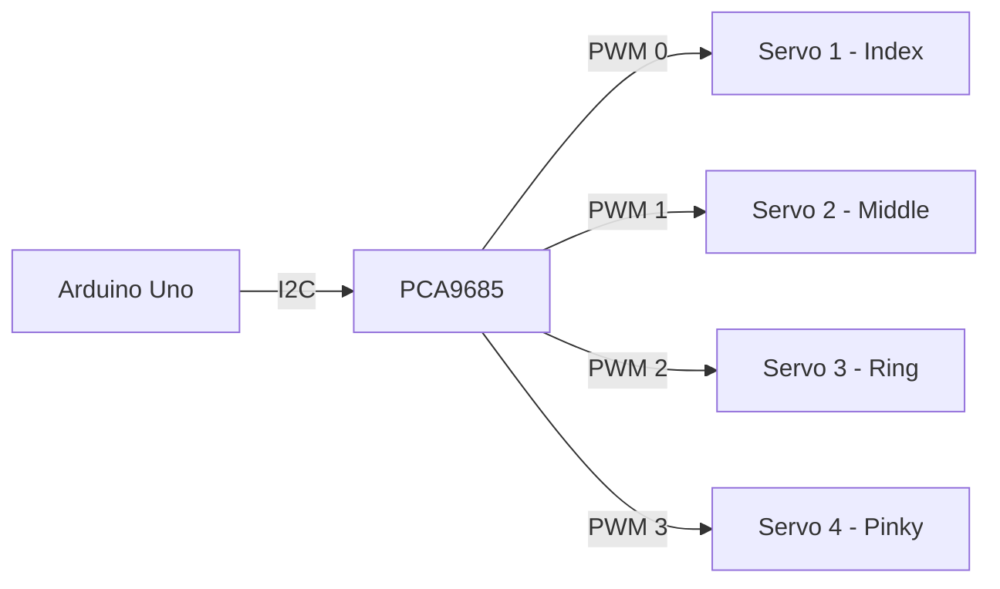
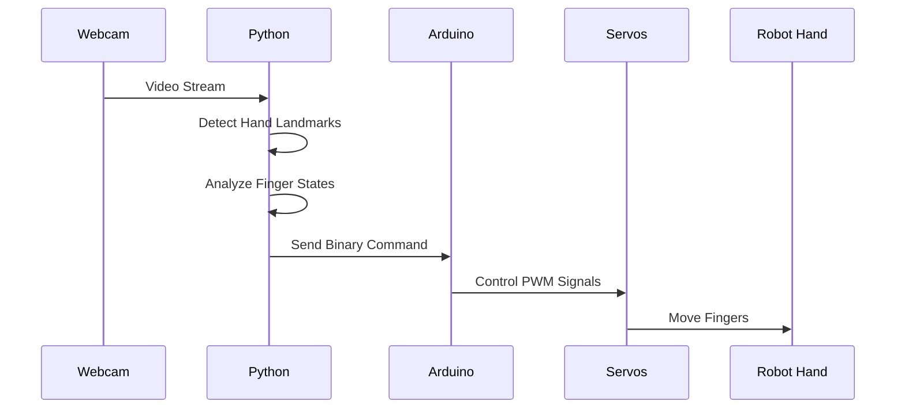

# Robot Hand Control via Hand Gesture Recognition

## Overview

This project enables real-time control of a robot hand using computer vision and hand gesture recognition. The system uses a webcam to detect hand movements and translates them into servo commands for a robotic hand.

## System Architecture



## Features

- **Real-time hand tracking** using MediaPipe
- **Multi-finger gesture recognition**
- **Serial communication** with Arduino
- **PWM servo control** via PCA9685
- **Low-latency performance** with FPS counter

## Prerequisites

### Hardware Requirements
- Webcam
- Arduino Uno
- PCA9685 PWM Servo Driver
- 4x Servo Motors
- Robot Hand Mechanism
- Jumper Wires

### Software Requirements
- OpenCV
- MediaPipe
- PySerial
- Arduino IDE

## Installation

### Python Dependencies
```bash
pip install opencv-python mediapipe pyserial
```

### Arduino Setup
1. Install Adafruit PWM Servo Driver Library
2. Upload `control_servo.ino` to Arduino
3. Connect PCA9685 to Arduino via I2C

## Wiring Diagram



## Usage

1. **Start the System**:
   ```bash
   python main.py
   ```

2. **Gesture Mapping**:
   - **Index Finger**: Controls Servo 0
   - **Middle Finger**: Controls Servo 1  
   - **Ring Finger**: Controls Servo 2
   - **Pinky Finger**: Controls Servo 3

3. **Operation**:
   - Show open fingers to activate corresponding servos
   - System sends binary commands (e.g., "1010" for index and ring fingers)
   - Press `ESC` to exit

## File Structure

```
robot-hand-control/
├── main.py                 # Python hand detection & control
├── control_servo.ino       # Arduino servo controller
└── README.md

```

## Workflow Process



## Configuration

### Python Parameters (main.py)
```python
handDetector(
    mode=False,           # Static image mode
    maxHands=2,           # Maximum hands to detect
    detectionCon=0.5,     # Detection confidence
    trackCon=0.5          # Tracking confidence
)
```

### Arduino Parameters (control_servo.ino)
```cpp
#define MIN_PULSE_WIDTH 650
#define MAX_PULSE_WIDTH 2350
#define FREQUENCY 50
```

## Control Protocol

### Command Format
- 4-bit binary string + carriage return
- Example: `"1010\r"` = Index and Ring fingers active

### Finger-to-Servo Mapping
| Finger | Bit Position | Servo Channel |
|--------|-------------|---------------|
| Index  | 0           | 0             |
| Middle | 1           | 1             |
| Ring   | 2           | 2             |
| Pinky  | 3           | 3             |

##  Troubleshooting

### Common Issues
1. **Serial Connection Failed**
   - Check COM port in `main.py`
   - Verify baud rate (115200)

2. **Servo Not Moving**
   - Verify PCA9685 power supply
   - Check I2C connections

3. **Hand Not Detected**
   - Ensure adequate lighting
   - Check webcam permissions

## Performance

- **Frame Rate**: 30+ FPS
- **Latency**: <100ms
- **Supported Gestures**: Individual finger control
